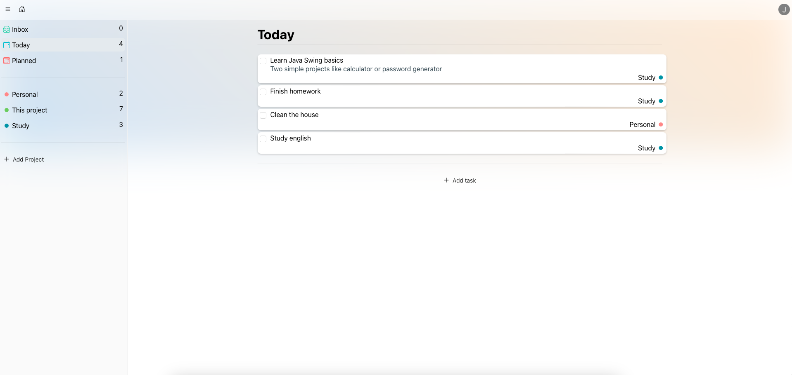
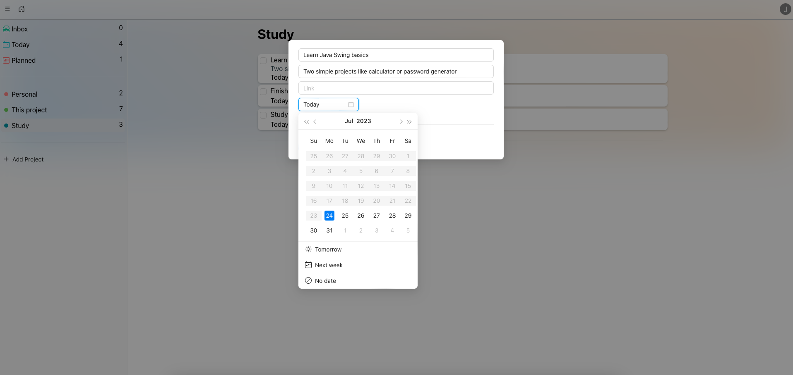

# ToDoApp

Task organizer written using MERN Stack.

[Live Demo](https://euphonious-stardust-4452c0.netlify.app)

## Features
* Login / registration system
* Editing account
* Password hashing
* Adding and editing projects / list of tasks
* Adding and editing tasks
* Drag&Drop

## Planned
* Searchbar
* Subtasks
* Project sections
* Changing the list from task form
* Attachments in tasks

## Tech Stack
* React.js
* react-beautiful-dnd
* AntDesign
* Bootstrap Icons
* Node.js
* Express.js
* MongoDB