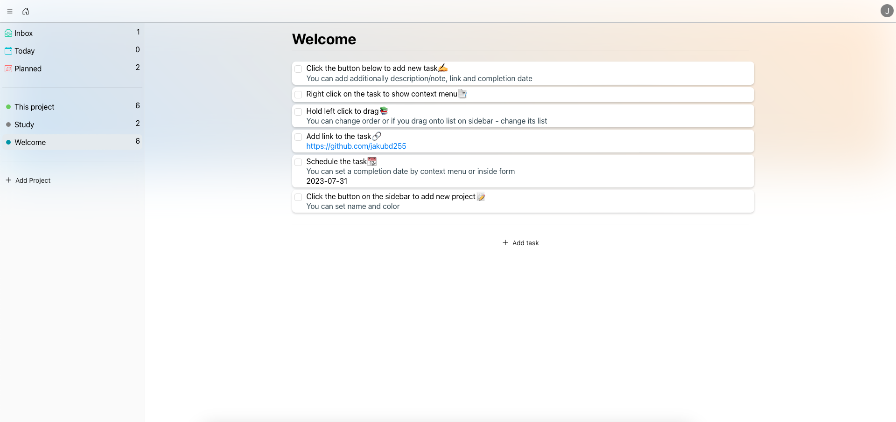

# ToDoApp

Task organizer written using MERN Stack.



## Features
* Log in / registration system
* Editing account
* Adding and editing projects - list of tasks
* Adding and editing tasks
* Drag&Drop

## Tech Stack
* React.js
* react-beautiful-dnd
* AntDesign
* Bootstrap Icons
* Node.js
* Express.js
* MongoDB

## How to run locally

```bash
git clone https://github.com/jakubd255/ToDoApp.git
```

### Run with Docker
#### 1. Create a **.env** file and configure it
```
ACCESS_TOKEN = YOUR_JWT_SECRET_KEY
```

#### 2. Build and run application
```bash
docker-compose --env-file ./.env up
```

#### 3. Open in browser
http://localhost:80


### Run without Docker

#### 1. Create your MongoDB database
https://cloud.mongodb.com

#### 2. Set up environmental variables
Create a **.env** inside the **server** directory and configure it with the environmental variables
```
PORT = 8000
MONGO_URI = URI_TO_YOUR_MONGO_DATABASE
ACCESS_TOKEN = YOUR_JWT_SECRET_KEY
```

#### 3. Run the application
In the **server** directory:
```bash
npm start
```

In the **client** directory;
```bash
npm run dev
```

#### 4. Open in browser
http://localhost:5173